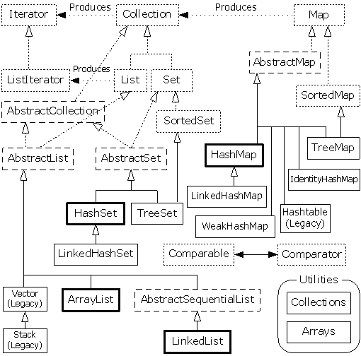
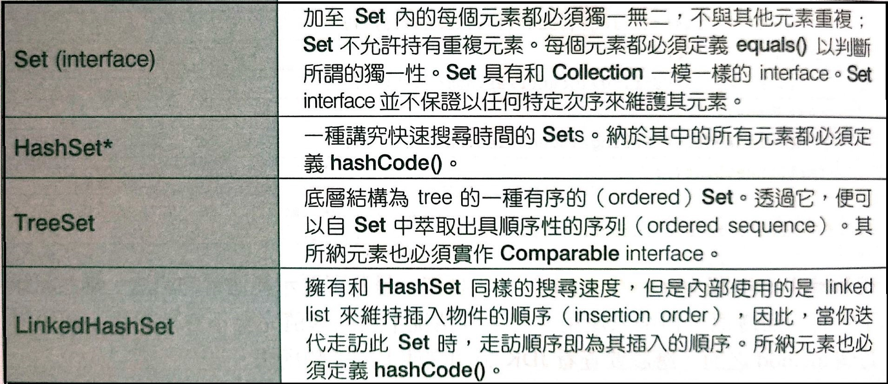

Arrays-and-Collections
=======================

Thinking in Java Ch 16 &amp; Ch 17

## Outline
- [Array](#Array)
	+ [Array的獨特之處](#array的獨特之處)
	+ [Array的記憶體](#array的記憶體)
	+ [多維Array](#多維array)
	+ [Array與泛型](#array與泛型)
	+ [建立測試資料](#建立測試資料)
	+ [Arrays 工具](#arrays-工具)
- [Collections](#collections)

## Array

一種重要的資料結構，幾乎所有高階的程式語言都提供了Array，
其優點在於當要儲存大量同性質的資料時是很有效率的，而由於
在記憶體中是以連續空間加以配置，這種連續的線性序列，使得它
存取元素的速度十分的快速，但也同樣有著它的限制，Array一旦
產生，它的大小就會固定，無法動態改變，且在編譯之前就必須
知道切確型別。


### Array的獨特之處

Array可以持有基本型別(Ex:int char),而這是其他的泛型容器所
做不到的，但在Autoboxing出現之後，基本型別與object之間的轉
換皆為自動進行，這就使得泛型容器在使用時好像可以持有基本型別
，也同時因為Autoboxing出現的出現加上容器有著比array更多的功能
，在很多時候我們會選擇容器而非Array


### Array的記憶體


	
兩者唯一的差別在於一個持有references 另一個持有基本型別之值
``` java

public class Reference {

	public static void main(String[] args) {
		int [] a1 = {1,2,3,4,5,6};
		int [] a2;
		Integer [] a3 = {new Integer(1),new Integer(2),3,4,5,6};
		Integer [] a4;
		a2 = a1;
		a4 = a3;
		System.out.println("Before:");
		for(int i = 0; i < 6; i++){
			System.out.println("a1["+i+"] = "+a1[i]);
		}
		
		for(int i = 0; i < 6; i++){
			a2[i] = a2[i] + 1;
		}
		
		System.out.println("After:");
		for(int i = 0; i < 6; i++){			
			System.out.println("a1["+i+"] = "+a1[i]);
		}
		System.out.println("Before:");
		for(int i = 0; i < 6; i++){			
			System.out.println("a3["+i+"] = "+a3[i]);
		}
		System.out.println("After:");
		for(int i = 0; i < 6; i++){
			a4[i] = a4[i] + 1;
			System.out.println("a3[" + i +"] = "+a3[i]);
			
		}
	}

}

```


### 多維Array

每一維度中的資料皆以{}區分，每一組相呼應的{}後定義的便是下一維度的Array資料
``` java
import java.util.Arrays;

public class TwoDimensionArray {
	
	public static void main(String[] args) {
		int [][] a = {
			{1,2,3},
			{4,5,6},
			{7,8,9},
		};
		System.out.println(Arrays.deepToString(a));
	}
}
```
``` java
import java.util.Arrays;

public class ThreeDimensionArray {

	public static void main(String[] args) {
		int [][][] a =new int[5][6][7];
		
		System.out.println(a.length);
		System.out.println(a[0].length);
		System.out.println(a[0][1].length);
		System.out.println(Arrays.deepToString(a));
	}
}
```


### Array與泛型

通常來說，array和泛型是不能混用的，我們無法使用參數化型別來形成array
``` java
Peel<Banana>[] = peels = new Peel<Banana>[10]; //Illegal
```
erasure會移去參數化型別的類別資訊，但array必須要知道所持物件的明確型別。
	
	
### 建立測試資料

在測試時，如果能輕鬆地將array填滿，對於測試會相當有幫助
	
- Arrays.fill()

java所提供的一個方法，能將單一數值或物件的reference複製到array中的每個位置。
``` java
package generatora;
import java.util.Arrays;

public class FillingArrays {

	public static void main(String[] args) {
		int size = 6;
		boolean[] a1 = new boolean[size];
		int[] a2 = new int[size];
		String[] a3 = new String[size];
		Arrays.fill(a1, true);
		System.out.println("a1 = " + Arrays.toString(a1));
		Arrays.fill(a2, 10);
		System.out.println("a2 = " + Arrays.toString(a2));
		Arrays.fill(a3, "Last");
		System.out.println("a3 = " + Arrays.toString(a3));
	}
}

	
```
但這麼做只能建立單一元素的Array，為了要更有彈性會搭配Generator以下介紹兩種產生器

``` java
package generatora;

public class CountingGenerator {
	public static class Boolean implements Generator<java.lang.Boolean> {
		private boolean value = false;

		public java.lang.Boolean next() {
			value = !value;
			return value;
		}
	}

	public static class Byte implements Generator<java.lang.Byte> {
		private byte value = 0;

		public java.lang.Byte next() {
			return value++;
		}
	}

	static char[] chars = ("abcdefghijklmnopqrstuvwxyz"
			+ "ABCDEFGHIJKLMNOPQRSTUVWXYZ").toCharArray();

	public static class Character implements Generator<java.lang.Character> {
		int index = -1;

		public java.lang.Character next() {
			index = (index + 1) % chars.length;
			return chars[index];
		}
	}

	public static class String implements Generator<java.lang.String> {
		private int length = 7;
		Generator<java.lang.Character> cg = new Character();

		public String() {
		}

		public String(int length) {
			this.length = length;
		}

		public java.lang.String next() {
			char[] buf = new char[length];
			for (int i = 0; i < length; i++)
				buf[i] = cg.next();
			return new java.lang.String(buf);
		}
	}

	public static class Short implements Generator<java.lang.Short> {
		private short value = 0;

		public java.lang.Short next() {
			return value++;
		}
	}

	public static class Integer implements Generator<java.lang.Integer> {
		private int value = 0;

		public java.lang.Integer next() {
			return value++;
		}
	}

	public static class Long implements Generator<java.lang.Long> {
		private long value = 0;

		public java.lang.Long next() {
			return value++;
		}
	}

	public static class Float implements Generator<java.lang.Float> {
		private float value = 0;

		public java.lang.Float next() {
			float result = value;
			value += 1.0;
			return result;
		}
	}

	public static class Double implements Generator<java.lang.Double> {
		private double value = 0.0;

		public java.lang.Double next() {
			double result = value;
			value += 1.0;
			return result;
		}
	}
}
```
	
``` java
package generatora;

import java.util.Random;

public class RandomGenerator {
	private static Random r = new Random(47);

	public static class Boolean implements Generator<java.lang.Boolean> {
		public java.lang.Boolean next() {
			return r.nextBoolean();
		}
	}

	public static class Byte implements Generator<java.lang.Byte> {
		public java.lang.Byte next() {
			return (byte) r.nextInt();
		}
	}

	public static class Character implements Generator<java.lang.Character> {
		public java.lang.Character next() {
			return CountingGenerator.chars[r
					.nextInt(CountingGenerator.chars.length)];
		}
	}

	public static class String extends CountingGenerator.String {
		// Plug in the random Character generator:
		{
			cg = new Character();
		} // Instance initializer

		public String() {
		}

		public String(int length) {
			super(length);
		}
	}

	public static class Short implements Generator<java.lang.Short> {
		public java.lang.Short next() {
			return (short) r.nextInt();
		}
	}

	public static class Integer implements Generator<java.lang.Integer> {
		private int mod = 10000;

		public Integer() {
		}

		public Integer(int modulo) {
			mod = modulo;
		}

		public java.lang.Integer next() {
			return r.nextInt(mod);
		}
	}

	public static class Long implements Generator<java.lang.Long> {
		private int mod = 10000;

		public Long() {
		}

		public Long(int modulo) {
			mod = modulo;
		}

		public java.lang.Long next() {
			return new java.lang.Long(r.nextInt(mod));
		}
	}

	public static class Float implements Generator<java.lang.Float> {
		public java.lang.Float next() {
			
			int trimmed = Math.round(r.nextFloat() * 100);
			return ((float) trimmed) / 100;
		}
	}

	public static class Double implements Generator<java.lang.Double> {
		public java.lang.Double next() {
			long trimmed = Math.round(r.nextDouble() * 100);
			return ((double) trimmed) / 100;
		}
	}
}
```
``` java
package generatora;

public class GeneratorTest {
	public static int size = 10;

	public static void test(Class<?> surroundingClass) {
		for (Class<?> type : surroundingClass.getClasses()) {
			System.out.print(type.getSimpleName() + ": ");
			try {
				Generator<?> g = (Generator<?>) type.newInstance();
				for (int i = 0; i < size; i++)
					System.out.printf(g.next() + " ");
				System.out.println();
			} catch (Exception e) {
				throw new RuntimeException(e);
			}
		}
	}

	public static void main(String[] args) {

		System.out.println("Counting : ");
		test(CountingGenerator.class);

		System.out.println("\nRandom : ");
		test(RandomGenerator.class);
	}

}
```		
要由產生器來產生array需要再另外建立一個工具
``` java
package generatora;

public class Generated {
	// Fill an existing array:
	public static <T> T[] array(T[] a, Generator<T> gen) {
		return new CollectionData<T>(gen, a.length).toArray(a);
	}

	// Create a new array:
	@SuppressWarnings("unchecked")
	public static <T> T[] array(Class<T> type, Generator<T> gen, int size) {
		T[] a = (T[]) java.lang.reflect.Array.newInstance(type, size);
		return new CollectionData<T>(gen, size).toArray(a);
	}
}
```
	
``` java
package generatora;

import java.util.Arrays;

public class GeneratedTest {

	public static void main(String[] args) {
		Integer[] a = { 9, 8, 7, 6 };
		System.out.println(Arrays.toString(a));
		a = Generated.array(a, new CountingGenerator.Integer());
		System.out.println(Arrays.toString(a));
		Integer[] b = Generated.array(Integer.class,
				new CountingGenerator.Integer(), 20);
		System.out.println(Arrays.toString(b));
	}

}
```	
透過這些我們就能建立一些有變化的測試資料
	
### Arrays 工具
java.util中提供的 Arrays class之中提供了許多方法用以處理array

- array的複製


這個方法並不再Arrays中，但也是一個相當有用的方法語法為 arraycopy(被copy的array, 起始位置, 要貼上的array, 起始位置,長度)
``` java
package Arrays;
import java.util.Arrays;

public class Arraycopy {

	public static void main(String[] args) {
		int[] i = new int[7]; 
		int[] j = new int[10];
		Arrays.fill(i, 10);
		Arrays.fill(j, 19);
		System.out.println("i = " + Arrays.toString(i));
		System.out.println("j = " + Arrays.toString(j));
		System.arraycopy(i, 0, j, 0, i.length);
		System.out.println("j = " + Arrays.toString(j));
	}
}
```
- array的比較

使用equals()來檢驗兩個arrays是否相等

``` java
package Arrays;
import java.util.Arrays;


public class ComparingArrays {

	public static void main(String[] args) {
		int[] a1 = new int[10];
		int[] a2 = new int[10];
		Arrays.fill(a1, 50);
		Arrays.fill(a2, 50);
		System.out.println(Arrays.equals(a1, a2));
		String[] s1 = new String[4];
		String[] s2 = new String[4];
		Arrays.fill(s1, "Yo!");
		Arrays.fill(s2, "Yo!");
		System.out.println(Arrays.equals(s1, s2));
	}
}
```
	
- array元素的比較
	

藉由實作java.lang.Comparable interface 讓某個class具有比較的能力
	
``` java
package CompType;

import generatora.Generated;
import generatora.Generator;

import java.util.Arrays;
import java.util.Random;

public class CompType implements Comparable<CompType> {
	int i;
	int j;
	private static int count = 1;

	public CompType(int n1, int n2) {
		i = n1;
		j = n2;
	}

	public String toString() {
		String result = "[i = " + i + ", j = " + j + "]";
		if (count++ % 3 == 0)
			result += "\n";
		return result;
	}

	public int compareTo(CompType rv) {
		return (i < rv.i ? -1 : (i == rv.i ? 0 : 1));
	}

	private static Random r = new Random(47);

	public static Generator<CompType> generator() {
		return new Generator<CompType>() {
			public CompType next() {
				return new CompType(r.nextInt(100), r.nextInt(100));
			}
		};
	}

	public static void main(String[] args) {
		CompType[] a = Generated.array(new CompType[12], generator());
		System.out.println("before sorting:");
		System.out.println(Arrays.toString(a));
		Arrays.sort(a);
		System.out.println("after sorting:");
		System.out.println(Arrays.toString(a));
	}
}
```

- array的排序
 
使用內建的sorting函式來進行排序(objects array需要有實作Comparator)
Java的排序演算法，會針對你所排序的型別來進行最佳化，面對基本型別是Quicksort
面對物件則採用Stable merge sort，所以我們不太需要擔心排序的效率問題。

``` java
package CompType;

import java.util.Arrays;
import java.util.Collections;

import generatora.Generated;
import generatora.RandomGenerator;

public class StringSorting {
	public static void main(String[] args) {
		String[] sa = Generated.array(new String[20],
				new RandomGenerator.String(5));
		System.out.println("Before sort: " + Arrays.toString(sa));
		Arrays.sort(sa);
		System.out.println("After sort: " + Arrays.toString(sa));
		Arrays.sort(sa, Collections.reverseOrder());
		System.out.println("Reverse sort: " + Arrays.toString(sa));
		Arrays.sort(sa, String.CASE_INSENSITIVE_ORDER);
		System.out.println("Case-insensitive sort: " + Arrays.toString(sa));
	}
}

```

- 在已排序的array中進行搜尋

在array排序完畢後，我們可以利用Arrays.binarySearch() 快速搜尋其中某個元素
但千萬別用在未經排序的array上，其結果無法預測。
	
``` java
package CompType;

import generatora.Generated;
import generatora.Generator;
import generatora.RandomGenerator;
import java.util.Arrays;

class ConvertTo {

	public static int[] primitive(Integer[] in) {
		int[] result = new int[in.length];
		for (int i = 0; i < in.length; i++)
			result[i] = in[i];
		return result;
	}

}

public class ArraySearching {

	public static void main(String[] args) {
		Generator<Integer> gen = new RandomGenerator.Integer(1000);
		int[] a = ConvertTo.primitive(Generated.array(new Integer[25], gen));
		System.out.println("Unsorted array: " + Arrays.toString(a));
		Arrays.sort(a);
		System.out.println("Sorted array: " + Arrays.toString(a));
		while (true) {
			int r = gen.next();
			int location = Arrays.binarySearch(a, r);
			if (location >= 0) {
				System.out.println("Location of " + r + " is " + location
						+ ", a[" + location + "] = " + a[location]);
				break;
			}
		}
	}
}

```

## Collections

將多個元素組織為一個單元的抽象設計方法，可以儲存、取用或操作資料，或者將資料從一個方法傳遞到另一個方法。
Collection有3個子介面 Set,List,Queue，這一系都為單一元素系，而Map介面這一系則是 key-value的成對元素系



### Collection的機能


這些為你能對Collection所進行的動作，Maps並不繼承自Collection需個別看待。

### Sets和儲存順序




其中在沒有條件限制的情況下Hashset為最好的選擇，因為它進行了速度的最佳化。

``` java
package com.DemoCollection;

import java.util.HashSet;
import java.util.LinkedHashSet;
import java.util.Set;
import java.util.TreeSet;

class SetType {
	int i;

	public SetType(int n) {
		i = n;
	}

	public boolean equals(Object o) {
		return o instanceof SetType && (i == ((SetType) o).i);
	}

	public String toString() {
		return Integer.toString(i);
	}
}

class HashType extends SetType {
	public HashType(int n) {
		super(n);
	}

	public int hashCode() {
		return i;
	}
}

class TreeType extends SetType implements Comparable<TreeType> {
	public TreeType(int n) {
		super(n);
	}

	public int compareTo(TreeType arg) {
		return (arg.i < i ? -1 : (arg.i == i ? 0 : 1));
	}
}

public class TypesForSet {
	static <T> Set<T> fill(Set<T> set, Class<T> type) {
		try {
			for (int i = 0; i < 10; i++)
				set.add(type.getConstructor(int.class).newInstance(i));
		} catch (Exception e) {
			throw new RuntimeException(e);
		}
		return set;
	}

	static <T> void test(Set<T> set, Class<T> type) {
		fill(set, type);
		fill(set, type); // Try to add duplicates
		fill(set, type);
		System.out.println(set);
	}

	public static void main(String[] args) {
		test(new HashSet<HashType>(), HashType.class);
		test(new LinkedHashSet<HashType>(), HashType.class);
		test(new TreeSet<TreeType>(), TreeType.class);
		// Things that don't work:
		test(new HashSet<SetType>(), SetType.class);
		test(new HashSet<TreeType>(), TreeType.class);
		test(new LinkedHashSet<SetType>(), SetType.class);
		test(new LinkedHashSet<TreeType>(), TreeType.class);
		try {
			test(new TreeSet<SetType>(), SetType.class);
		} catch (Exception e) {
			System.out.println(e.getMessage());
		}
		try {
			test(new TreeSet<HashType>(), HashType.class);
		} catch (Exception e) {
			System.out.println(e.getMessage());
		}
	}
}
```

### SortedSet

SortedSet保證其中元素處於排序狀態
，並且通過其interface所提供的一些methods提供了額外的機能
- Comparator comparator():產生一個"被這個set所使用"的Comparator 或是傳回null代表以自然方式排序。
- Object first():產生lowest element。
- Object last():產生highest element。
- Sorted subSet(fromElement, toElement):產生set子集，範圍從fromElement(含)到toElement(不含)
- SortedSet headSet(toElement):產生set子集，其中元素皆小於toElement。
- SortedSet tailSet(fromElemnt):產生set子集，其中元素皆大於等於fromElement。
	
``` java
package com.DemoCollection;

import java.util.*;

public class SortedSetDemo {
	public static void main(String[] args) {
		SortedSet<String> sortedSet = new TreeSet<String>();
		Collections.addAll(sortedSet,
				"one two three four five six seven eight".split(" "));
		System.out.println(sortedSet);
		String low = sortedSet.first();
		String high = sortedSet.last();
		System.out.println(low);
		System.out.println(high);
		Iterator<String> it = sortedSet.iterator();
		for (int i = 0; i <= 6; i++) {
			if (i == 3)
				low = it.next();
			if (i == 6)
				high = it.next();
			else
				it.next();
		}
		System.out.println(low);
		System.out.println(high);
		System.out.println(sortedSet.subSet(low, high));
		System.out.println(sortedSet.headSet(high));
		System.out.println(sortedSet.tailSet(low));
	}
}
```

### Queues
元素之取出具有一定的順序，一般都是以FIFO的順序來取出有時會有特殊順序像是以優先權來進行排序，
除了並行處理的應用外，Queue有兩種實作，LinkedList 和 PriorityQueue，兩者的區分在於其排序行為而非效能。

``` java
package com.DemoCollection;

import java.util.concurrent.*;
import java.util.*;
import com.generator.*;

public class QueueBehavior {
	private static int count = 10;

	static <T> void test(Queue<T> queue, Generator<T> gen) {
		for (int i = 0; i < count; i++)
			queue.offer(gen.next());
		while (queue.peek() != null)
			System.out.print(queue.remove() + " ");
		System.out.println();
	}

	static class Gen implements Generator<String> {
		String[] s = ("one two three four five six seven " + "eight nine ten")
				.split(" ");
		int i;

		public String next() {
			return s[i++];
		}
	}

	public static void main(String[] args) {
		test(new LinkedList<String>(), new Gen());
		test(new PriorityQueue<String>(), new Gen());
		test(new ArrayBlockingQueue<String>(count), new Gen());
		test(new ConcurrentLinkedQueue<String>(), new Gen());
		test(new LinkedBlockingQueue<String>(), new Gen());
		test(new PriorityBlockingQueue<String>(), new Gen());
	}
}

```
可以發現除了具有優先順序的queue之外，由Queue中取出的順序和插入時的順序相同

### Priority Queues
具有優先序的Queue，以優先權來進行排序，透過實作Comparable來加以控制。

``` java
package com.DemoCollection;

import java.util.*;

class ToDoList extends PriorityQueue<ToDoList.ToDoItem> {
	static class ToDoItem implements Comparable<ToDoItem> {
		private char primary;
		private int secondary;
		private String item;

		public ToDoItem(String td, char pri, int sec) {
			primary = pri;
			secondary = sec;
			item = td;
		}

		public int compareTo(ToDoItem arg) {
			if (primary > arg.primary)
				return +1;
			if (primary == arg.primary)
				if (secondary > arg.secondary)
					return +1;
				else if (secondary == arg.secondary)
					return 0;
			return -1;
		}

		public String toString() {
			return Character.toString(primary) + secondary + ": " + item;
		}
	}

	public void add(String td, char pri, int sec) {
		super.add(new ToDoItem(td, pri, sec));
	}

	public static void main(String[] args) {
		ToDoList toDoList = new ToDoList();
		toDoList.add("Empty trash", 'C', 4);
		toDoList.add("Feed dog", 'A', 2);
		toDoList.add("Feed bird", 'B', 7);
		toDoList.add("Mow lawn", 'C', 3);
		toDoList.add("Water lawn", 'A', 1);
		toDoList.add("Feed cat", 'B', 1);
		while (!toDoList.isEmpty())
			System.out.println(toDoList.remove());
	}
}
```

### Deques

雙邊開口的queue，和queue相似，但從兩邊都可以插入和刪除元素，在java的標準library中沒有明確的deque介面，不過
我們可以使用合成的技巧，使用LinkedList中的相關methods來打造Deque class。

``` java
package com.DemoCollection;

import java.util.*;

public class Deque<T> {
	private LinkedList<T> deque = new LinkedList<T>();
	public void addFirst(T e) { deque.addFirst(e); }
	public void addLast(T e) { deque.addLast(e); }
	public T getFirst() { return deque.getFirst(); }
	public T getLast() { return deque.getLast(); }
  	public T removeFirst() { return deque.removeFirst(); }
  	public T removeLast() { return deque.removeLast(); }
  	public int size() { return deque.size(); }
  	public String toString() { return deque.toString(); }
} 
```

``` java
package com.DemoCollection;

public class DequeTest {
	static void fillTest(Deque<Integer> deque) {
		for (int i = 20; i < 27; i++)
			deque.addFirst(i);
		for (int i = 50; i < 55; i++)
			deque.addLast(i);
	}

	public static void main(String[] args) {
		Deque<Integer> di = new Deque<Integer>();
		fillTest(di);
		System.out.println(di);
		while (di.size() != 0)
			System.out.print(di.removeFirst() + " ");
		System.out.println();
		fillTest(di);
		while (di.size() != 0)
			System.out.print(di.removeLast() + " ");
	}
}
```

### Maps

map的基本概念就是維護key-value的關聯性，所以我們可以使用key查到相對應的value，而一個key只能對映到一個value。
java的標準函式庫中包含了很多種類型的Maps:HashMap、TreeMap、LinkedHashMap、WeakHashMap、ConcurrentHashMap、
IdemtityHashMap，這些Maps都具有相同的Map Interface，但在不同面向上，有不同的特點，EX:效率、持有和表示key-value pairs的次序、物件被持有的時間長短、map在多執行緒程式中運作的方式及決定key是否相同的方式。

``` java
package com.Maps;

public class AssociativeArray<K, V> {
	private Object[][] pairs;
	private int index;

	public AssociativeArray(int length) {
		pairs = new Object[length][2];
	}

	public void put(K key, V value) {
		if (index >= pairs.length)
			throw new ArrayIndexOutOfBoundsException();
		pairs[index++] = new Object[] { key, value };
	}

	@SuppressWarnings("unchecked")
	public V get(K key) {
		for (int i = 0; i < index; i++)
			if (key.equals(pairs[i][0]))
				return (V) pairs[i][1];
		return null; // Did not find key
	}

	public String toString() {
		StringBuilder result = new StringBuilder();
		for (int i = 0; i < index; i++) {
			result.append(pairs[i][0].toString());
			result.append(" : ");
			result.append(pairs[i][1].toString());
			if (i < index - 1)
				result.append("\n");
		}
		return result.toString();
	}

	public static void main(String[] args) {
		AssociativeArray<String, String> map = new AssociativeArray<String, String>(
				6);
		map.put("sky", "blue");
		map.put("grass", "green");
		map.put("ocean", "dancing");
		map.put("tree", "tall");
		map.put("earth", "brown");
		map.put("sun", "warm");
		try {
			map.put("extra", "object"); // Past the end
		} catch (ArrayIndexOutOfBoundsException e) {
			System.out.println("Too many objects!");
		}
		System.out.println(map);
		System.out.println(map.get("ocean"));
	}
}
```
### Map的效能

在Map中效能式根本的議題，如果再搜尋某個key時，於get()中使用線性搜尋，速度會非常的慢，而這正是Hashmap
提高速度的地方，利用hash code的特殊值取得該物件的某些資訊，接著將它轉為`相對唯一`之int，Hashmap取得某物件
之hashCode()並利用它快速的找到該key，這能很大的提升效能。

同樣的在沒有條件限制之下HashMap也是最好的選擇，其它的實作強調其它的特性，並不能像HashMap一樣快


### SortedMap

SortedMap 保證會對元素的keys進行排序，因此允許提供一些額外機能

- Comparator comparator()
- T firstKey()
- T lastKey()
- SortedMap SubMap(from key, toKey)
- SortedMap heapMap(toKey)
- SortedMap tailMap(fromMap)

``` java
package com.Maps;

import java.util.*;

public class SortedMapDemo {
	public static void main(String[] args) {
		TreeMap<Integer, String> sortedMap = new TreeMap<Integer, String>(
				new CountingMapData(10));
		System.out.println(sortedMap);
		Integer low = sortedMap.firstKey();
		Integer high = sortedMap.lastKey();
		System.out.println(low);
		System.out.println(high);
		Iterator<Integer> it = sortedMap.keySet().iterator();
		for (int i = 0; i <= 6; i++) {
			if (i == 3)
				low = it.next();
			if (i == 6)
				high = it.next();
			else
				it.next();
		}
		System.out.println(low);
		System.out.println(high);
		System.out.println(sortedMap.subMap(low, high));
		System.out.println(sortedMap.headMap(high));
		System.out.println(sortedMap.tailMap(low));
	}
}

```

### LinkedHashMap

基於速度的考量對所有內容都做了hashing，會依照元素置入的時間順序進行，另外在它的建構子中可以設定使用LRU法則來
存取其元素。


### Hashing 和 hashing code

當我們在撰寫自己的class作為key時，會碰上一個hashmaps常見的問題，我們創造好了key及其所對應的value
並將他們放到HashMap中，接著我們想用key來尋找value時會發現我們無法通過key來找到value，這是由於我們所使用的key
會繼承自Object，而Object的hashCode()其預設是使用記憶體位置來產生hashcode，因此第一個產生並放入HashMap中的key
和我們用來搜尋的第二個key有著不一樣的Hashcode。

``` java
package com.Maps;

import java.lang.reflect.*;
import java.util.*;

public class Groundhog {
	protected int number;

	public Groundhog(int n) {
		number = n;
	}

	public String toString() {
		return "Groundhog #" + number;
	}
}

public class Prediction {
	private static Random rand = new Random(47);
	private boolean shadow = rand.nextDouble() > 0.5;

	public String toString() {
		if (shadow)
			return "Six more weeks of Winter!";
		else
			return "Early Spring!";
	}
}


public class SpringDetector {
	
	public static <T extends Groundhog> void detectSpring(Class<T> type)
			throws Exception {
		Constructor<T> ghog = type.getConstructor(int.class);
		Map<Groundhog, Prediction> map = new HashMap<Groundhog, Prediction>();
		for (int i = 0; i < 10; i++)
			map.put(ghog.newInstance(i), new Prediction());
		System.out.println("map = " + map);
		Groundhog gh = ghog.newInstance(3);
		System.out.println("Looking up prediction for " + gh);
		if (map.containsKey(gh))
			System.out.println(map.get(gh));
		else
			System.out.println("Key not found: " + gh);
	}

	public static void main(String[] args) throws Exception {
		detectSpring(Groundhog.class);
	}
}
```

這時我們會想要進行hashCode()的OverRide，但只有這麼做還是不行，因為當HashMap試著判斷你所給的key是否等於表格中的
某個key時便會透過equals()來判斷，同樣地，預設的Object.equals()只會比較記憶體位置，所以當我們要在HashMap中使用
自己撰寫的classes作為key時，一定要同時OverRide hashCode()和equals()

``` java

package com.Maps;

public class Groundhog2 extends Groundhog {
	public Groundhog2(int n) {
		super(n);
	}

	public int hashCode() {
		return number;
	}

	public boolean equals(Object o) {
		return o instanceof Groundhog2 && (number == ((Groundhog2) o).number);
	}
}

public class SpringDetector2 {
	public static void main(String[] args) throws Exception {
		SpringDetector.detectSpring(Groundhog2.class);
	}
}
```
一個合適的equals()所需的5個條件

- 反身性(Reflexive) : 對任何 x ， x.equals(x)必須要回傳 true。
- 對稱性(Symmetric) : 對任何 x、y if x.equals(y) = true 則 y.equals(x) = true。。。。
- 遞移性(Transitive) : 對任何 x、y、z if x.equals(y) = true 且 y.equals(z) = true 則 x.equals(z) = true。。。
- 一致性(Consistent) : 對任何 x、y 如果用來判斷的資料沒有被修改過，那麼無論呼叫幾次 x.equals(y) 都必須回傳相同
的 true或 false。
- 對於任何非空元素的x ，x.equals(null)應該要回傳 false。

### 基於速度考量的Hashing

Hashing的目的完全是為了速度，它所採取的作法是將key儲存於`某處`它便可以快地找到key，而用來儲存一群元素的結構中
速度最快的是Array，Array便被用來表現key的資訊，而我們同時也知道array一經配置便無法改變容量大小，這便引發了另外
一個問題，如果我們想在Maps中儲存任意數量的values，但key的數量卻受限於array的容量，這時要怎麼辦。

答案是array並不儲存key。我們可以從key物件得到一個數字用來作為array的索引，這個數字就是hashCode()所產生的
hash code，為了解決因array容量不變而引發的問題，多個keys可能會得到同一個索引值，也就是可能會有碰撞發生。

搜尋value的過程，會從計算其hash code開始然後使用此hash code做為 array的索引，如果碰撞完全不會發生，就是一個
完美的 hashing function (但這通常都是特例) ，其他時候，碰撞是透過`外部鏈結(external chaining)` 來解決，array並
不直接指向某一個value，而是指向一串values，這些values以線性方式透過 equals() 進行搜尋，這種搜尋是會緩慢許多
但一般來說hash function夠好，同一個slot上只會有少數幾個values，我們可以很快地找到正確的slot然後在少數幾個value之間進行比較，就能夠找到目標。

Hash table中的 slots 一般會被稱為buckets， 為了平均分配，buckets的個數通常都是質數，它是一個LinkedList Array，每當碰撞一個新物件加入會直接被至於List的尾端，雖然Java不讓我們產生泛型的array，但是可以產生一個
Reference到這樣的Array。


設計hashCode()時最重要的因素就是，不論hashCode()何時被呼叫，針對同一個物件，每次被呼叫都應該產生相同的值。

這裡提供一個基本的hashCode()配方

- 1.定義名為result的int變數，賦予一個非零的常數 ex:17;
- 2.對equals()所會用到的欄位f，分別計算其int 型別的HashCode c:
	+ Boolean  c = (f ? 0:1)
	+ Byte char short int  c = (int)f
	+ Long  c = (int)(f^(f>>>32))
	+ Float  c = Float.floatToIntBits(f);
	+ Double long I = Double.doubleToLongBits(f)  在將 I 放入Long的方法
	+ Objects  c = f.hashCode()
- 綜合以上 : result = 37 * result + c;
- 回傳 result 
- 檢查 hashCode() 並確保相等的instances會回傳相同的hash code


### Lists的選擇

- 需要快速的隨機存取 : ArrayList
- 需要時常在中間地帶插入或移除元素 :　LinkedList
 
### Sets的選擇

- 幾乎所有動作HashSet的效能都優於TreeSet
- 需要排序過的Set : TreeSet
- 需要走訪各個元素時 : LinkedHashSet較快

### Maps的選擇

- 幾乎所有動作HashMap的效能都優於TreeMap
- 需要排序過的Map : TreeMap
- 需要走訪各個元素時 : LinkedHashMap較快


